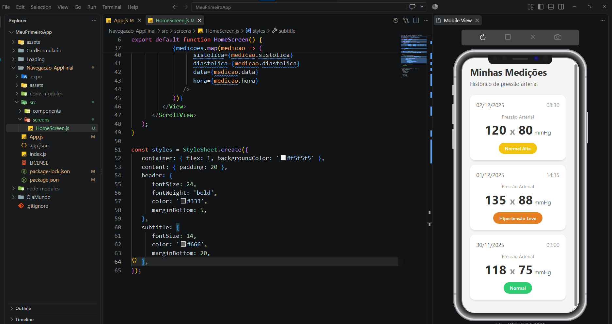
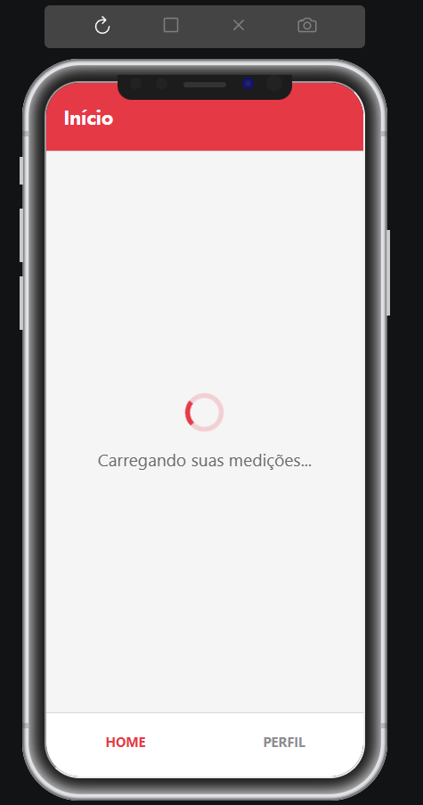
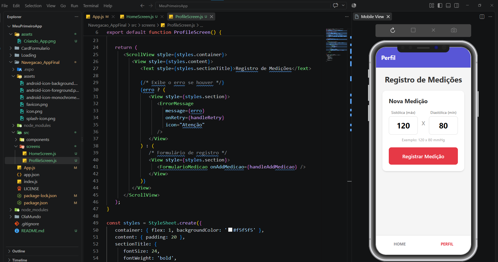

# Desenvolvendo Apps com React Native

Aplicação desenvolvida para estudo e aprendizado usando React Native, Node.js e expo.

---

## Autor
**Renan de Oliveira Mendes**

---

### Aplicação

O app começou como um serviço simples de acompanhamento médico, que permitiu o usuário inserir dados referentes a pressão arterial, apresentando duas páginas - Homescreen e Perfil

